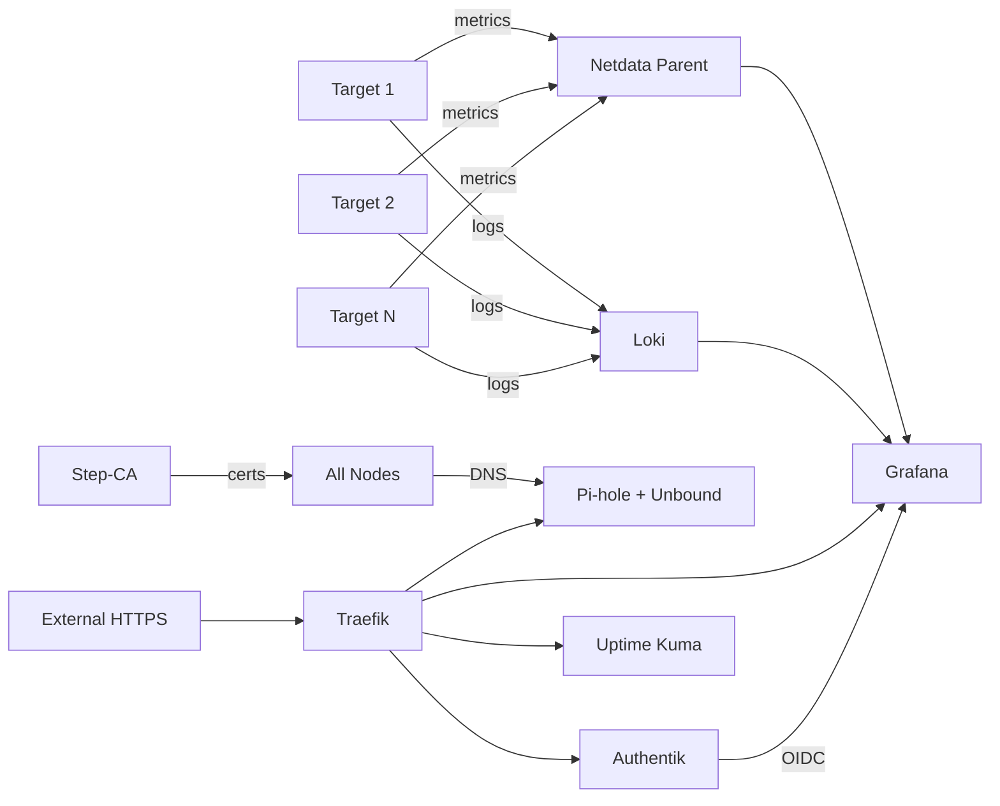

# Architecture

## Node Model

```
Control Node                         Target Nodes (N)
┌─────────────────────┐             ┌─────────────────────┐
│ Tier 3: Stacks      │             │ Tier 2: Agents      │
│  ├─ Traefik         │◄───────────►│  ├─ Netdata (child) │
│  ├─ Authentik       │             │  ├─ Promtail        │
│  ├─ Step-CA         │             │  ├─ Docker Socket   │
│  ├─ Pi-hole         │             │  └─ Dockge          │
│  ├─ Loki            │             ├─────────────────────┤
│  ├─ Netdata (parent)│             │ Tier 1: Foundation  │
│  ├─ Grafana         │             │  ├─ common          │
│  ├─ Uptime Kuma     │             │  ├─ security        │
│  └─ Dockge          │             │  ├─ docker          │
├─────────────────────┤             │  ├─ watchtower      │
│ Tier 1: Foundation  │             │  └─ restic          │
│  (same as targets)  │             └─────────────────────┘
└─────────────────────┘
```

## Three-Tier Role Model

| Tier | Name | Hosts | Purpose |
|------|------|-------|---------|
| **Tier 1** | Foundation | `all` | Base OS hardening, Docker, backups — identical on every node |
| **Tier 2** | Target Agents | `targets` | Lightweight monitoring/logging agents that stream to control |
| **Tier 3** | Control Stacks | `control` | Full management services (proxy, SSO, dashboards, DNS, PKI) |

## Data Flows



- **Metrics**: Netdata children → Netdata parent (port 19999)
- **Logs**: Promtail agents → Loki (port 3100)
- **DNS**: All nodes → Pi-hole + Unbound (port 53)
- **Proxy**: External HTTPS → Traefik (ports 80/443) → backend services
- **PKI**: Step-CA issues internal certs, root CA distributed to all targets
- **SSO**: Authentik provides OIDC for Grafana and other services

## Playbook Orchestration

### `site.yml` (Main Entry Point)

1. **Pre-flight** — Gathers facts, detects virtualization (LXC/VM/bare-metal), sets skip flags
2. **Tier 1** — Applies foundation roles to ALL nodes in declared order
3. **Tier 2** — Applies agent roles to `targets` group, verifies connectivity to control
4. **Tier 3** — Applies stack roles to `control` group in dependency order
5. **Post-deploy** — Distributes Step-CA root certificate to all targets
6. **Validation** — HTTP health checks on all control services, prints summary with URLs

### Other Playbooks

| Playbook | Purpose |
|----------|---------|
| `bootstrap.yml` | Day-0 prep: Python, SSH keys, base packages |
| `control.yml` | Control node deployment (includes Tier 1) |
| `target.yml` | Target node deployment |
| `add-target.yml` | Add new server: bootstrap + deploy agents |
| `update.yml` | Rolling system updates (`serial: 1`) |
| `upgrade.yml` | Docker image upgrades with health checks |
| `backup.yml` | Trigger manual Restic backups |

## Docker Conventions

- **Deploy path**: All services to `/opt/stacks/{service-name}/` (Dockge-compatible)
- **Compose format**: All `docker-compose.yml` generated from Jinja2 templates
- **Logging**: JSON driver, 10MB max size, 3 files — configured in `daemon.json`
- **Network**: `traefik-public` bridge network shared by all Traefik-proxied services
- **Environment files**: Each service has a `.env.j2` template deployed alongside compose
- **Health checks**: Services expose health endpoints checked by playbooks and Uptime Kuma

## LXC Container Support

LXC containers are auto-detected in `site.yml` pre-flight. These roles are automatically skipped:

- `lvm_config` — no block devices in LXC
- `swap` — kernel-level, not supported in unprivileged LXC
- `qemu_agent` — not a KVM guest

Override manually in `host_vars/{hostname}.yml`:

```yaml
lvm_skip: true
swap_skip: true
qemu_agent_skip: true
```

LXC containers require `keyctl=1` and `nesting=1` in Proxmox/LXD config.
